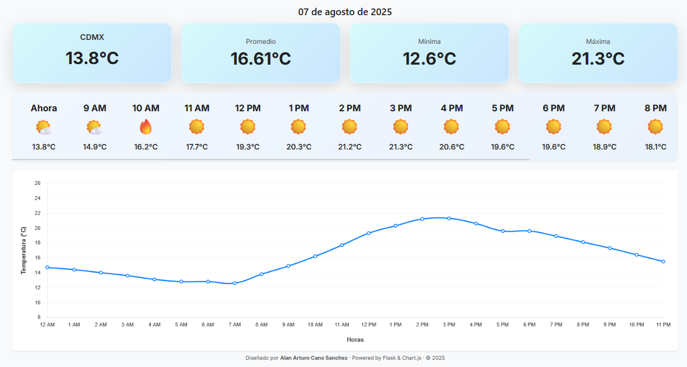

# Weather Data Engineering Pipeline

> Automatiza la recolección, procesamiento y visualización de datos climáticos con Airflow, MinIO y Flask.

---

## 🧠 ¿Qué es este proyecto?

Este pipeline de datos meteorológicos está diseñado para:

1. **Extraer** datos climáticos por hora desde una API externa.
2. **Almacenar** los datos crudos en un data lake local (formato JSON).
3. **Transformar** los datos con `pandas` y guardarlos como Parquet.
4. **Visualizar** KPIs del clima en tiempo real mediante un dashboard web (Flask + Chart.js).

> Este proyecto forma parte de mi portafolio personal como práctica integral de data engineering.

---

## ⚙️ Tecnologías utilizadas

- **Apache Airflow** – Orquestación de pipelines
- **pandas** – Procesamiento de datos
- **MinIO (S3 local)** – Data lake local con compatibilidad S3
- **Flask** – Visualización web (dashboard)
- **Chart.js + HTML/CSS** – KPIs y gráficas de temperatura
- **Docker Compose** – Contenedores para todos los servicios

---

## 🗂️ Estructura del proyecto

weather_pipeline_project/
│
├── dags/ # DAGs de Airflow (extract + process)
├── data_lake/ # Datos locales montados (crudos y procesados)
│ ├── raw/
│ ├── processed/
├── minio_data/ # Datos almacenados por MinIO (weather-raw, weather-processed)
├── flask_app/ # App web (Flask)
│ ├── static/
│ ├── templates/
│ └── app.py
├── scripts/ # Scripts auxiliares (ej. eliminar buckets)
├── notebooks/ # Análisis exploratorio (opcional, usando pandas)
├── docker/ # Configuración adicional para Airflow
├── docker-compose.yml # Orquestación con Docker Compose
├── requirements.txt # Dependencias del proyecto
└── README.md

---

## 📈 Dashboard final

El resultado es una aplicación web con:

- Temperatura actual, mínima, máxima y promedio del día.
- Visualización por hora.
- Gráfica interactiva con evolución de la temperatura diaria.

---

## 🚀 Cómo ejecutar este proyecto

### 1. Clonar el repositorio

---

- git clone https://github.com/tu_usuario/weather_pipeline_project.git
- cd weather_pipeline_project

### 2. Levantar la infraestructura

- docker-compose up --build

Esto levantará:

- Apache Airflow (http://localhost:8080)
- MinIO (http://localhost:9001)

Correr el dashboard dentro de la carpeta flask_app (python app.py)

- Flask App (http://localhost:5000)

### 3. Activar los DAGs en Airflow

- Accede a http://localhost:8080

Credenciales por defecto:

Usuario: airflow
Contraseña: airflow

Activa los siguientes DAGs:

- extract_weather_data
- process_weather_data

Ambos correrán automáticamente cada hora.

### 4. Ver el dashboard

- Accede a http://localhost:5000

### 📌 Extras y detalles

- Sensor inteligente: El DAG de procesamiento espera a que el de extracción termine, gracias a un ExternalTaskSensor.

- Formateo limpio: Solo se almacena el Parquet del día actual.

### 🧠 Aprendizajes

- Cómo orquestar pipelines reales con Airflow y sensores dependientes.
- Uso de MinIO como alternativa local a S3.
- Automatización ETL real con datos externos.
- Creación de dashboards ligeros con Flask + Chart.js.
- impieza y transformación de datos con pandas.

### 👤 Autor

- [Alan Arturo Cano Sanchez](https://www.linkedin.com/in/alan-arturo-cano-sanchez-511855361)
🚀 ¡Gracias por visitar este proyecto!

---
